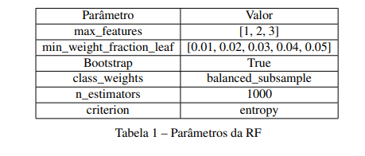
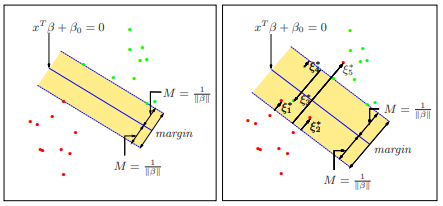
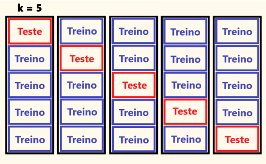
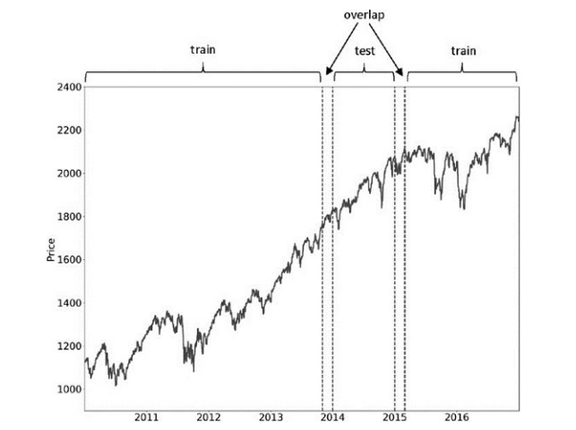
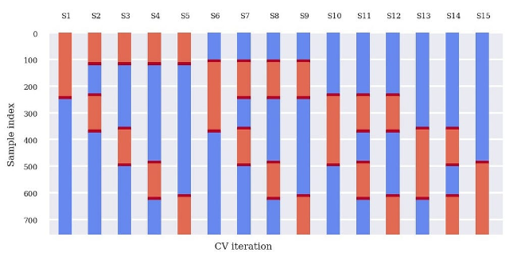
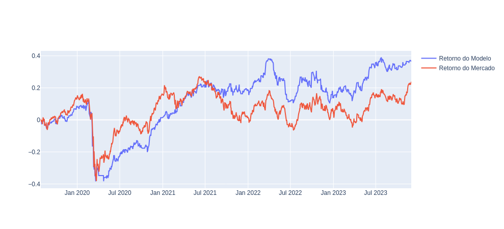

# Fraude de Crédito

## 💼 Contexto:
O mercado financeiro é afetado diariamente por fatores econômicos, culturais, políticos e aleatórios (catástrofes naturais). Diante dessa grande variação, prever a direção futura do mercado torna-se uma tarefa de extrema dificuldade. Nesse cenário, técnicas estatísticas e matemáticas são comumente utilizadas para previsão de mercado.

Diante dessas técnicas, os modelos de aprendizado de máquina se apresentam como uma das principais ferramentas utilizadas na literatura de predição de movimento de mercados. Neste estudo, foi utilizado o método Random Forest e Support Vector Machine. 

Como variável dependente do modelo foi utilizado 1 e 0, representando movimentos de alta e baixa do mercado em $t+1$, respectivamente. Além disso, como variáveis explicativas utilizou-se 8 indicadores técnicos, sendo seus valores extraídos tanto na forma contínua quanto binária. A avaliação de cada modelo considerou cada tipo de variável independente (contínua e binária), proporcionando uma compreensão do impacto das mesmas.

Para melhorar a performance do modelo abordou-se a técnica de iteração conhecida como GridSearch que busca os melhores parâmetros para o modelo. Essa abordagem, aliada à validação cruzada, permitiu a obtenção de resultados mais robustos e confiáveis.

### Modelos
#### Floresta Aleatória
No modelo de aprendizado de floresta aleatória, as árvores que compõem a floresta,
são geradas por meio da técnica de bagging. As árvores são treinadas com subamostras de
treinos geradas por meio do boostrap e por um número x de features (variáveis independentes),
que são escolhidas aleatoriamente a cada nó da árvore. Essas duas técnicas combinadas geram
árvores menos correlacionadas possíveis, resultando numa maior adversidade para o modelo e
consequentemente uma menor variância.

Vale destacar que, a técnica de random subfeatures é utilizada para evitar a presença de
variáveis independentes excessivamente influentes durante processo de bagging no treinamento.
Ou seja, sem essa técnica, a feature de maior importância tenderá aparecer em praticamente
todas as árvores, resultando em árvores muito similares entre si (JAMES et al., 2013).

Como a técnica de bagging tem como principal características a diminuição da variância,
então serão escolhidos parâmetros para que o modelo base (árvore decisão) tenha maior variância
possível (PRADO, 2018).



- Bootstrap = True: Constrói múltiplas amostras, com reposição, a partir dos dados de
treinamento, gerando avaliação das variabilidades das estimações.
- Min_weight_fraction_leaf : Permite definir a fração mínima dos dados necessária para o
nó final ser válido ou não. Isso permite ajustar a complexidade da árvore, influenciando
diretamente na sua generalização.
- Class_weights = balanced_subsample: Ajusta os pesos das classes a fim de lidar com
desbalanceamento de classes nos dados, garantindo que os modelos fracos sejam treinados
com dados equilibrados.
- Max_Features: Limita o número de variáveis independentes para cada divisão de uma
árvore. Quando esse parâmetro é igual a um, então a cada nó da árvore será escolhida,
aleatoriamente, uma variável independente, gerando uma maior discrepância entre as
árvores.
- N_estimator = 1000: Define o número de árvores para formar a floresta.
- Criterion = Entropy: Critério de divisão dos nós.

Dessa maneira, a diversidade entre as árvores permite que elas explorem diferentes
padrões nos dados contribuindo de forma mais significativa para agregação final dos modelos.
Além disso, a floresta aleatória consegue captar os movimentos voláteis e complexos do mercado
uma vez que seu algoritmo não faz suposições sobre as distribuições das variáveis independentes,
gerando mais robustez para o modelo

#### Support Vector Machine
É um modelo, o qual, seu principio parte de uma reta tracejada, conhecida como hiperplano de separação, que divide os dados entre positivos e negativos. Esse hiperplano é um
subespaço plano de dimensão p – 1, onde p é numero de variáveis independentes.



A ideia de classificação dos dados por meio de um hiperplano se difere totalmente dos
algoritmos que foram apresentados. O hiperplano possui uma margem, conhecida como Maximal
Margin que é calculada por meio da técnica de "optimal separating hyperplane". Essa técnica
calcula a maior distância miníma entre a observação de treino e o hiperplano, ou seja, a maior
distância mínima entre a separação das classes. As observações que estão na fronteira da margem
são chamadas de vetores suportes e são elas que determinam o hiperplano e a margem (JAMES
et al., 2013). Dessa forma, podemos classificar a variável independente de acordo com o lado
mais próximo que ela se encontra da margem, sendo sua classe -1,1.

Support Vector Machine é considerado uma extensão do SVC que aplica um aumento de
dimensionalidade para lidar com variáveis as quais não podem ser divididas por um hiperplano
de duas dimensões. Esse problema pode ser resolvido adicionando polinômios de diferentes
graus das variáveis independentes no modelo. Entretanto, isso geraria um grande número de
variáveis e consequentemente um maior custo computacional, tornando o treinamento do modelo
praticamente impossível. Para superar esse problema, o SVM aplica uma técnica conhecida
como "kernels".

Dessa maneira, a ideia principal do algoritmo é encontrar uma margem entre os vetores de suporte e o hiperplano que possa gerar a melhor classificação possível. Os únicos parâmetros desse modelo é a constante C e variável do kernel.


### Validação Cruzada

#### Problemática do K-Fold
A validação cruzada é uma técnica muito utilizada na literatura de aprendizado de máquina para avaliar o desempenho de um modelo. Neste estudo, a validação cruzada teve papel crucial na avaliação dos modelos de treinamento durante a seleção de hiperparâmetros.

A validação cruzada com K-fold divide os dados em K partes
de tamanhos iguais, chamadas de folds e utiliza parte dos dados disponíveis para ajustar o modelo e outra parte para testá-lo.



Supondo que a base de dados utilizada nesta validação cruzada abranja um período de 5
anos, cada fold corresponderá a um conjunto de informações de 1 ano. Nesse sentido, nota-se
que na primeira iteração, o primeiro ano é utilizado como conjunto de teste, enquanto os outros 4
anos para treinamento. Considerando que todas as configurações possíveis são testadas entre os
folds de teste e treinamento, o primeiro ano é avaliado em apenas um cenário (utilizando anos 2,
3, 4 e 5 como treino), o que pode resultar em um viés e falsas descobertas do modelo. Para uma
avaliação mais robusta é necessário que os folds de teste sejam testados em um conjunto maior
de cenários.

Além disso, caso o modelo utilize variáveis independentes com defasagens temporais de
até 14 dias, pode-se identificar duas problemáticas: (i) é possível que os primeiros 14 dias do
conjunto de teste contenham informações provenientes da base de treinamento; (ii) o início do
fold de treinamento que sucede um fold de teste também pode conter informações do fold de
teste anterior. Ambas questões levam a um possível vazamento de dados e podem comprometer
a capacidade de generalização do modelo.

#### Purge

Como solução para o vazamento de dados, Prado (2018) propôs a técnica de Purge. Essa
técnica, lida diretamente com os 2 problemas, por meio da criação de um intervalo entre folds
de treino e teste. O gráfico a seguir Preço x Ano, exemplifica a técnica de purge:



Nessa figura nota-se, que o conjunto de teste (test) antecede e sucede um conjunto de
treinamento (train), caindo na problemática de vazamento de dados. No entanto, ao criar o
intervalo (overlap) entre os folds de treino e teste, o vazamento de dados é evitado.

#### Combinatorial Purged Cross-Validation (CPCV)

Além de resolver a problemática de vazamento de dados, Prado (2018) propôs uma
validação cruzada mais robusta e menos suscetível ao sobreajuste, conhecida como "Combinatorial Purged Cross-Validation (CPCV)". O algoritmo funciona de maneira parecida com
validação cruzada K-fold, entretanto, podemos ter mais de um fold de teste. Na Figura 6 temos
um exemplo de CPCV em que os dados são divididos em 6 folds, com 4 de treinamento e 2 de
teste, gerando um total de 15 combinações diferentes a serem avaliadas.



### Dados

20 anos de dados diários do Ibovespa foram utilizados, entre período de 2002 e 2022.
Esse período contém as principais crises financeiras: Subprime(2008) e Covid-19(2020). Os
dados foram extraídos por meio de uma biblioteca do python chamada yfinance, gerando uma base de dados com 4949 dias, sendo composta por 52,25% movimentos de altas e 47,75% de
baixa.

#### Variável Dependente(Alvo)

A variável dependente do modelo será o fechamento do Ibovespa no período t + 1. Nesse
contexto, se o fechamento do Ibovespa no dia seguinte indicar um movimento de alta, a variável
terá valor 1, caso contrário (movimento de baixa) terá valor 0. Portanto, a variável de saída será
uma variável binária


#### Variável Independente(Features)

As variáveis explicativas do modelo serão derivadas de 8 indicadores técnicos utilizados
na literatura de Kara, Boyacioglu e Baykan (2011), assim como foi utilizado por Patel et
al. (2015). Muitos fundos de investimento e investidores aceitam e utilizam os critérios dos
indicadores técnicos na tomada de decisão de investimento (KIM, 2003).
Inicialmente, os indicadores técnicos são obtidos como valores contínuos. A fim de
explorar os critérios dos indicadores eles serão transformados em variáveis binárias, sendo 1
caso indiquem movimento de alta e 0 para movimento de baixa.
Essa abordagem segue a metodologia utilizada em Patel et al. (2015) e será aplicada na
análise dos modelos. Portanto, os modelos serão testados tanto com variáveis contínuas quanto
com variáveis binarias, permitindo a comparação de desempenho entre ambas.

### Resultados

O modelo que melhor performou foi de SVM, superando o ibovespa no período de 2018~2023.





## Contato
bernardo.alemar@hotmail.com

# Executar o Script em sua máquina local
## Pré-requisitos:

Antes de começar, certifique-se de ter o seguinte instalado em sua máquina:

- Python 3.10.12
- pip (gerenciador de pacotes Python)
- Git (ferramenta de controle de versão)

Uma vez que você tenha isso instalado, abra um terminal em sua máquina local e execute os seguintes comandos:

1. **Clone o repositório:**
   ```bash
   git clone https://github.com/bAlemar/Prevendo-Movimento-do-Ibovespa.git

2. **Navegue até o diretório do repositório clonado:**
   ```bash
   cd Prevendo-Movimento-do-Ibovespa

3. **Crie um ambiente virtual:**
   ```bash
    python -m venv ambiente_virtual

4. **Ative o ambiente virtual:**

   **4.1 Linux**
   ```bash
    source ambiente_virtual/bin/activate
   ```
   **4.2 Windows**
   ```bash
    ambiente_virtual\Scripts\activate

5. **Instale as Dependências:**
- Instale de acordo com Dashboard que deseja utilizar.
   ```bash
    pip install -r requeriments.txt 

    
    